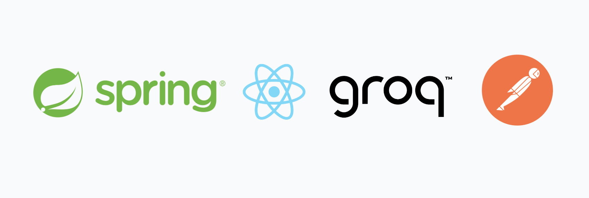
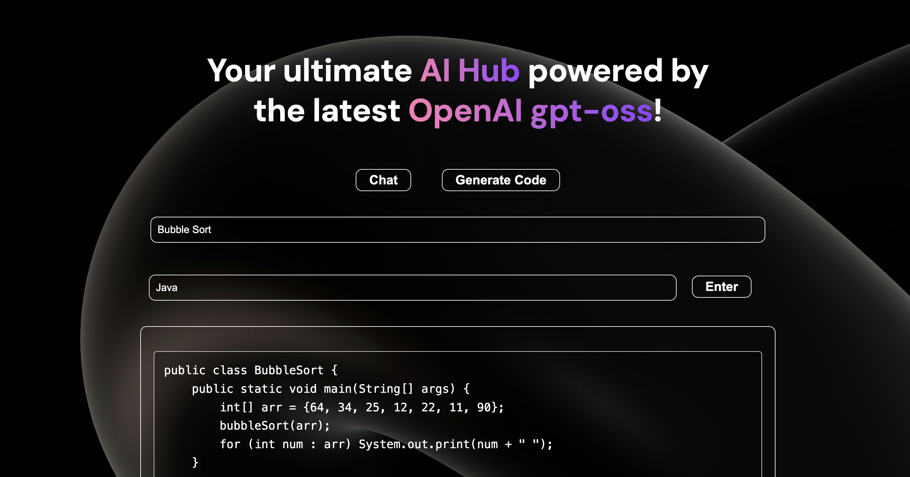
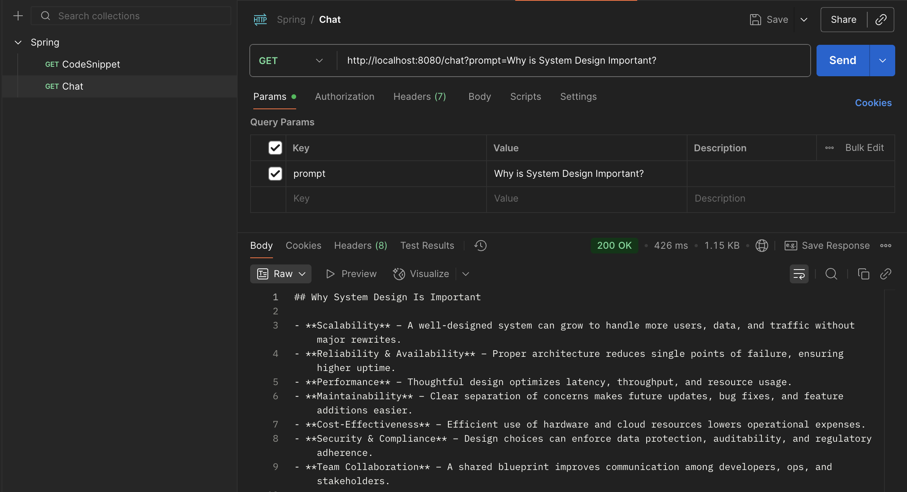

# 🚀 AI Hub - Spring Boot + React + Groq (OpenAI GPT-oss-20b)

An AI-powered web application built with **Spring Boot** (backend) and **React** (frontend), leveraging **Groq’s high-performance inference** to run **OpenAI GPT-OSS-20B** for chat, code generation, and more.



## 📌 Features

- **Chat Interface** — Real-time AI conversation using GPT-OSS-20B.
- **Code Generator** — Generate code snippets in multiple programming languages.
- **Two-Tab UI** — Switch between Chat and Code modes without losing context.
- **Fast Inference** — Powered by **Groq** for ultra-low-latency responses.
- **Backend API** — Spring Boot REST endpoints for chat and code requests.




## 🛠 Tech Stack
- **React 19** — Component-based UI.
- **Spring Boot 3+** — REST API framework.
- **Java 22** — Latest Java features for performance & maintainability.
- **Spring AI** — Integration layer for AI models.
- **Groq API** — High-speed inference serving OpenAI GPT-OSS-20B.


## 📂 Project Structure
- Configured `application.properties` to `application.yml` for better readability, hierarchical data organization, and easier management of nested AI model configurations (e.g., Groq API key, model name, and server settings)

```
spring:
  application:
    name: demo
  ai:
    openai:
      api-key: "API_KEY_HERE" 
      base-url: "https://api.groq.com/openai"
```

### Note: SpringBoot applications runs at `Port 8080` by default

- Dependency Management in `pom.xml` file to integrate Spring AI:
```
<dependencies>
		<dependency>
			<groupId>org.springframework.boot</groupId>
			<artifactId>spring-boot-starter-web</artifactId>
		</dependency>

		<dependency>
			<groupId>org.springframework.ai</groupId>
			<artifactId>spring-ai-starter-model-openai</artifactId>
		</dependency>

		<dependency>
			<groupId>org.springframework.boot</groupId>
			<artifactId>spring-boot-starter-test</artifactId>
			<scope>test</scope>
		</dependency>
	</dependencies>
```

## Why GPT-OSS-20B with Groq?

This project uses **Groq's GPT-OSS-20B**, a powerful **20-billion parameter open-source language model**, to enable advanced AI capabilities such as chat, code generation, and intelligent text processing.  

### 🚀 Why Groq?
- **Lightning-Fast Responses** – Groq's hardware-accelerated LPU™ (Language Processing Unit) architecture delivers **millisecond-level inference**, making interactions feel instant compared to traditional GPU-backed APIs.
- **Native Support for Open-Source Models** – Groq provides seamless hosting for top-tier open models, including LLaMA, Mistral, Gemma, and OSS GPT variants, without the vendor lock-in of closed models.
- **Scalability & Reliability** – Built for production-grade AI workloads with low-latency APIs and high uptime.

### 💡 Why GPT-OSS-20B?
- **Open-Source Freedom** – Fully transparent weights and architecture allow customization and fine-tuning for specific domains.
- **Massive Knowledge Capacity** – With 20 billion parameters, it rivals proprietary models in reasoning, coding, and creative tasks.
- **Cost-Effective** – No per-token costs tied to closed ecosystems—Groq’s efficient hosting makes high-performance AI more affordable.

In short, **Groq + GPT-OSS-20B** means **blazing speed, open-source flexibility, and production-ready reliability**—perfect for both experimentation and enterprise-grade AI applications.

## 🟠 Testing Spring Boot Application with Postman

Postman is a powerful tool for sending HTTP requests to test APIs without writing any code.  
In this project, Postman is used to verify that the Spring Boot backend endpoints work as expected.

- Download and install [Postman](https://www.postman.com/downloads/).
- Open the application and create a **new request**.

### Sending a `GET` Request



